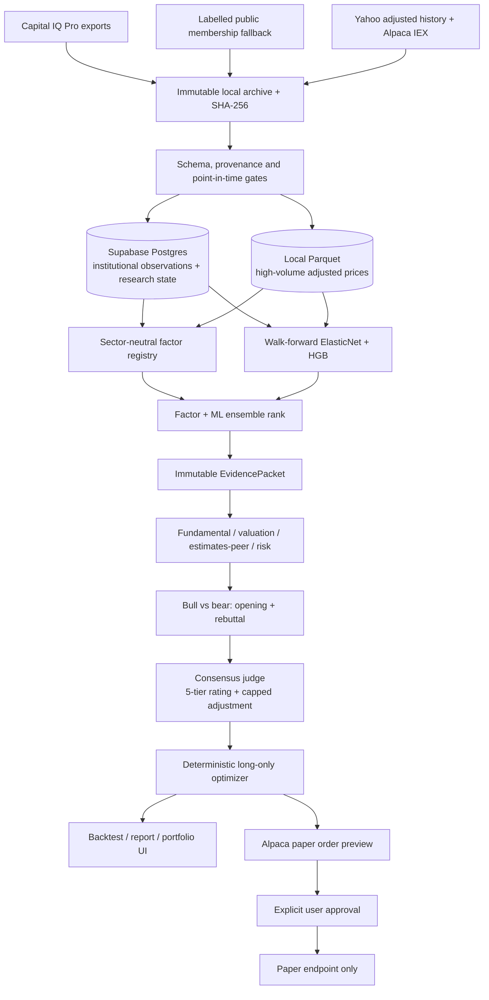

# S&P 500 Institutional Multi-Agent Quant Platform

An English-language, local-first research system that extends TradingAgents with point-in-time Capital IQ ingestion, deterministic factor/ML portfolio construction, evidence-grounded LangGraph debate, quality-first DeepSeek routing, Supabase Postgres research persistence, a local Parquet market-data lake and Alpaca paper-only execution.

## Project status

The application, database schema, deterministic engines, Agent graph, API, UI and
paper-trading safety boundary are implemented. A **current Capital IQ research
loop is now verified end to end**: 500 S&P 500 companies, 21 fundamental/valuation
metrics and seven FY+1 estimate/revision metrics produce all six factor families;
the revisions family currently covers 489 companies. These are data-engineering
and factor-coverage results, not buy recommendations or performance claims.

The live external-service smoke loop also passes. One 2026-09-01 company packet
contained 30 attributable observations and completed all nine
`deepseek-v4-pro` nodes (four independent analysts, two bull/bear rounds and the
judge); all 25 references selected by the judge resolved to the immutable packet.
The matching no-debate route completed by reusing the analyst cache, and the two
routes produced different rating directions, confirming that debate is an active
ablation rather than decorative orchestration. Alpaca created one five-minute
paper-order preview against the fixed paper endpoint and submitted zero orders.
DeepSeek returned the model alias/version but no `system_fingerprint`, so that
field is deliberately stored as null instead of being fabricated. This is a
connectivity and control result, not a model benchmark or investment result.

The repository remains in the **historical data-completion phase**, not the final
investment-result phase. A current Capital IQ snapshot cannot certify a five-year
point-in-time study. The final case study and GitHub release remain gated on
historical fundamentals, monthly estimate snapshots, the model benchmark and the
24-month debate ablation. The 2017–2026 adjusted-price warm-up and study window is
populated and quality checked, but remains an explicitly labelled Yahoo/Alpaca
substitute until a licensed Capital IQ price export is available.

## Architecture



The deeper component and reproducibility notes are in
[`docs/ARCHITECTURE.md`](docs/ARCHITECTURE.md).

## Author's design philosophy

This project is built around five convictions:

1. **The LLM is a research committee, not a calculator or portfolio manager.**
   Python owns ratios, timestamps, scores, risk constraints, weights and orders.
2. **Institutional data matters only when its provenance survives the pipeline.**
   Every observation keeps its stable company ID, ticker-at-date, availability
   time, snapshot date, source hash and ingestion time.
3. **Debate is useful only when it is falsifiable.** Bull, bear and judge outputs
   must cite the immutable evidence packet; the narrative adjustment is capped.
4. **A weak honest result is more valuable than a tuned demo.** SPY, equal-weight,
   factor, ML and Agent ablations are frozen before evaluation, with transaction
   costs and uncertainty reported even when the strategy underperforms.
5. **The product should remain small enough to understand.** It is an academic
   and self-use platform: operational simplicity is preferred, while the few
   non-negotiable controls—look-ahead prevention, licensed-data boundaries and
   paper-only execution—stay strict.

## Data-source hierarchy

Capital IQ is the analytical center of gravity, not one interchangeable feed
among many:

| Priority | Source | Permitted role |
|---|---|---|
| 1 — research authority | S&P Capital IQ Pro | company statements, filing availability, consensus estimates/revisions, valuation inputs, peers, ownership and evidence used by research Agents |
| 2 — labelled factor support | Yahoo adjusted history / Alpaca IEX | realized-return labels, momentum, volatility, beta, execution calendar, transaction-cost simulation and paper-account synchronization |
| 3 — reasoning layer | DeepSeek | evidence-grounded comparison, bull/bear debate and report synthesis; never a source of financial facts |

External market APIs may help discover or test a factor, but they cannot replace
Capital IQ company analysis or be presented as S&P data. Every table and report
keeps the source distinction visible.

## From S&P data to a stock portfolio

The production workflow is deliberately sequential:

1. Import point-in-time Capital IQ statements and estimate snapshots.
2. Form the historical S&P 500 universe using ticker-at-date and stable IDs.
3. Calculate value, quality, growth, revisions, momentum and low-risk factors;
   inspect rank IC, monotonicity, stability and cross-factor correlation.
   A company receives an investable composite only when at least four of six
   families are present and at least two are institutional families (value,
   quality, growth or revisions); price-only diagnostics cannot become picks.
4. Train ElasticNet and histogram gradient boosting only on prior months, then
   rank next-month excess return versus SPY.
5. Send roughly ten high-value cases—new leaders, deteriorating holdings and
   factor/ML disagreements—to the evidence-grounded Agent committee.
6. Apply the judge's bounded score adjustment and optimize 20–30 long-only
   holdings under stock, sector, volatility and turnover constraints.
7. Review the report and paper-order preview; no order is submitted implicitly.

The exact Capital IQ export cadence, filenames, import commands and readiness
checks are in [`docs/OPERATING_RUNBOOK.md`](docs/OPERATING_RUNBOOK.md).

## How the platform is used in practice

Capital IQ Pro is the primary research terminal; this repository is the
reproducible analysis and decision layer around it:

1. In Capital IQ, open a saved S&P 500 screen and select the research fields for
   the question being studied. The verified live templates are
   `TRAINING_V3_SP500_INSTITUTIONAL_FACTORS_CURRENT` and
   `TRAINING_V3_SP500_ESTIMATES_REVISIONS_CURRENT`.
2. Export **Results As Table Function**. The workbook keeps Capital IQ keyfield,
   FY/LTM/current and period-end parameters, which the importer records as source
   metadata instead of flattening away.
3. Upload/import the workbook locally. The platform archives the original by
   SHA-256, validates stable IDs and timestamps, rejects malformed observations,
   normalizes units and writes licensed observations to Supabase.
4. Run the current-snapshot audit and Factor Lab. Python calculates valuation,
   quality, growth, estimate-revision breadth, momentum and risk; candidate lists
   remain diagnostics until portfolio constraints and research review pass.
5. For selected companies, build an `EvidencePacket` from the licensed numbers
   and source references. Only when the licence gate permits external processing
   does DeepSeek receive that structured packet for analyst views, bull/bear
   debate and a bounded consensus adjustment. Strict structured outputs require
   exact Evidence IDs; malformed or uncited responses get one repair attempt and
   then fail the company case.
6. The deterministic optimizer creates a 20–30 stock proposal. The user reviews
   evidence, dissent, exposures and turnover before any Alpaca paper preview.

Other APIs are important but subordinate: they supply return labels, market-risk
features, validation and simulated execution. They never silently replace a
Capital IQ fundamental or estimate in a company research report.

## Safety and data boundary

- Institutional observations, provenance, factor outputs, Agent records, portfolios and case-study results are stored in the isolated `institutional_quant` schema in Supabase. Use a direct or session-pooler connection string in `SUPABASE_DB_URL`; the driver disables prepared statements for pooler compatibility.
- High-volume adjusted daily prices are a reproducible local cache at `IQ_PRICE_LAKE_PATH` (default `data/market/prices.parquet`). This prevents derived public-market data from consuming the Supabase free-tier database. Reads still use one storage interface, and select sources in the order Capital IQ, Yahoo, then Alpaca.
- Original Capital IQ files remain in `data/raw` and are never sent to the LLM. Structured numeric evidence can leave the machine only after `CIQ_EXTERNAL_PROCESSING_CONFIRMED=true`.
- Capital IQ values can enter Supabase only after `CIQ_CLOUD_STORAGE_CONFIRMED=true`. Confirm both permissions against the applicable NTU/S&P agreement first.
- The broker adapter rejects every endpoint except `https://paper-api.alpaca.markets`. A five-minute preview plus explicit approval is required for each paper order.
- DuckDB databases under `data/demo` are for tests and synthetic demonstrations only. DuckDB also queries the production Parquet price lake in-process; it is not the authoritative institutional database.

## Quick start

```bash
cp .env.example .env
# Fill SUPABASE_DB_URL and, when needed, DEEPSEEK_API_KEY / Alpaca paper keys.
# Enable the two CIQ gates only after the licence checks described above.
export UV_PROJECT_ENVIRONMENT=/Users/guohuiwen/.cache/sp500-institutional-quant-venv
uv sync --extra dev
uv run sp500iq preflight
uv run sp500iq init-db
uv run sp500iq sync-yahoo-prices --start 2017-04-01 --end 2026-08-31
uv run sp500iq sync-alpaca-prices --start 2017-04-01 --end 2026-08-31
uv run sp500iq serve
```

Open `http://127.0.0.1:8000`. The seven pages are Data Status, Factor Lab, Research Runs, Debate, Portfolio, Backtest and Paper Trading.

After filling `.env`, `uv run sp500iq preflight --live` tests Supabase, DeepSeek and the read-only Alpaca paper account endpoint without printing secrets or submitting orders. Missing keys and licence gates are reported as `WAIT`, so setup can proceed incrementally.

The production app keeps the retained TradingAgents provider stack optional. Install that dependency group before running the complete upstream regression suite:

```bash
uv sync --extra dev --extra tradingagents-upstream
uv run pytest -q
```

After the base backtest and 24-month Agent study are available, `uv run sp500iq case-study` freezes 5/10/25 bps cost cases, debate/no-debate ablations when present, source hashes, code hash and model fingerprints under `output/manifests`.

For a no-key, no-licensed-data engineering check:

```bash
uv run sp500iq synthetic-demo
uv run sp500iq backtest-demo
IQ_DATABASE_BACKEND=duckdb IQ_DATABASE_PATH=data/demo/institutional_quant.duckdb uv run sp500iq serve
```

This external volume creates macOS AppleDouble `._*` files inside virtual environments, so the commands above intentionally keep the venv on the internal disk. Project code and data remain on the external volume.

Capital IQ export contracts are documented in [`docs/CIQ_EXPORT_TEMPLATES.md`](docs/CIQ_EXPORT_TEMPLATES.md). Import one file at a time with:

```bash
uv run sp500iq import-ciq fundamentals /absolute/path/fundamentals.xlsx
```

For a live-only Capital IQ snapshot, supply the actual download timestamp
explicitly. This is accepted for instruments, fundamentals and estimates, but it
does not turn the file into historical point-in-time evidence. Fundamentals must
still include Capital IQ Financial Filing Date, and estimates must include the
company-specific target fiscal period:

```bash
uv run sp500iq import-ciq instruments /absolute/path/current-sp500.xlsx \
  --current-snapshot-as-of 2026-09-01 \
  --current-snapshot-effective-at 2026-09-01T04:17:07+00:00

uv run sp500iq import-ciq fundamentals /absolute/path/current-factors.xlsx \
  --current-snapshot-as-of 2026-09-01 \
  --current-snapshot-effective-at 2026-09-01T09:10:19+00:00

uv run sp500iq import-ciq estimates /absolute/path/current-estimates.xlsx \
  --current-snapshot-as-of 2026-09-01 \
  --current-snapshot-effective-at 2026-09-01T10:01:36+00:00

uv run python scripts/audit_current_snapshot.py --as-of 2026-09-01
uv run sp500iq factor-snapshot --as-of 2026-09-01 --top 25
```

If the NTU entitlement cannot export historical membership, use the explicit
mixed-source fallback for the fixed study window:

```bash
uv run sp500iq sync-public-sp500-membership \
  --start 2021-09-01 --end 2026-08-31
```

This command archives and hashes a pinned [pitindex](https://github.com/arielNacamulli/pitindex)
event dataset, applies source-linked S&P Global/SEC events after its build, and
reconciles the end roster before writing any rows. The source manifest records
`capital_iq_data=false`; certification and reports identify it as non-Capital-IQ.
It is a practical public reconstruction, not a substitute for CRSP-level vendor
authority. The command refuses dates after its verified coverage ceiling until
the pinned source and official overrides are refreshed.

The primary API is under `/api/v1`; interactive OpenAPI documentation is available at `/docs`. Historical certification fails on missing datasets, missing required availability timestamps, rejected rows, incomplete membership coverage or incomplete price coverage. Backtest returns always use the next available session open and include the requested one-way cost.

## Upstream attribution

This repository was adapted from [TauricResearch/TradingAgents](https://github.com/TauricResearch/TradingAgents/tree/2448d0a12576f9b2ddcd5980a0630833423d1e1b), pinned at commit `2448d0a12576f9b2ddcd5980a0630833423d1e1b`, under Apache-2.0. The upstream source, history, licence and the original README below are retained. New institutional-quant code lives in `institutional_quant/`.

---

<p align="center">
  
</p>

<div align="center" style="line-height: 1;">
  <a href="https://arxiv.org/abs/2412.20138" target="_blank"></a>
  <a href="https://discord.com/invite/hk9PGKShPK" target="_blank"></a>
  <a href="https://x.com/TauricResearch" target="_blank"></a>
  <a href="https://github.com/TauricResearch/" target="_blank"></a>
</div>
<br>
<div align="center">
  <a href="https://github.com/TauricResearch" target="_blank"></a>
</div>
<br>
<div align="center">
  <!-- Keep these links. Translations will automatically update with the README. -->
  <a href="https://www.readme-i18n.com/TauricResearch/TradingAgents?lang=de">Deutsch</a> | 
  <a href="https://www.readme-i18n.com/TauricResearch/TradingAgents?lang=es">Español</a> | 
  <a href="https://www.readme-i18n.com/TauricResearch/TradingAgents?lang=fr">français</a> | 
  <a href="https://www.readme-i18n.com/TauricResearch/TradingAgents?lang=ja">日本語</a> | 
  <a href="https://www.readme-i18n.com/TauricResearch/TradingAgents?lang=ko">한국어</a> | 
  <a href="https://www.readme-i18n.com/TauricResearch/TradingAgents?lang=pt">Português</a> | 
  <a href="https://www.readme-i18n.com/TauricResearch/TradingAgents?lang=ru">Русский</a> | 
  <a href="https://www.readme-i18n.com/TauricResearch/TradingAgents?lang=zh">中文</a>
</div>

---

# TradingAgents: Multi-Agents LLM Financial Trading Framework

## News
- [2026-08] **TradingAgents v0.4.0** released with look-ahead / point-in-time fixes across FRED macro, social sentiment, and the decision-log memory; clearer decision signals; working CLI checkpoint resume; Trader price grounding; and the GPT-5.6 and GLM-5.3 models. See [CHANGELOG.md](CHANGELOG.md) for the full list.
- [2026-07] **TradingAgents v0.3.1** released with correctness and stability fixes: Alpha Vantage look-ahead filtering, graph-router crash-safety, graph-shape-aware checkpoint resume, working crypto sentiment sources, a configurable LLM retry budget, Bedrock API-key auth, and Claude Sonnet 5 / Fable 5 support.
- [2026-06] **TradingAgents v0.3.0** released with a verified data-access contract, an expanded provider registry (NVIDIA, Kimi, Groq, Mistral, Bedrock, and any OpenAI-compatible endpoint), FRED and Polymarket data vendors, a current-generation model catalog, and a CI gate.
- [2026-05] **TradingAgents v0.2.5** released with the grounded Sentiment Analyst, GPT-5.5 etc. model coverage, Qwen/GLM/MiniMax dual-region support, `TRADINGAGENTS_*` env-var configurability with API-key auto-detection, remote Ollama support, non-US alpha benchmarks, and ticker path-traversal hardening.
- [2026-04] **TradingAgents v0.2.4** released with structured-output agents (Research Manager, Trader, Portfolio Manager), LangGraph checkpoint resume, persistent decision log, DeepSeek/Qwen/GLM/Azure provider support, Docker, and a Windows UTF-8 encoding fix.
- [2026-03] **TradingAgents v0.2.3** released with multi-language support, GPT-5.4 family models, unified model catalog, backtesting date fidelity, and proxy support.
- [2026-03] **TradingAgents v0.2.2** released with GPT-5.4/Gemini 3.1/Claude 4.6 model coverage, five-tier rating scale, OpenAI Responses API, Anthropic effort control, and cross-platform stability.
- [2026-02] **TradingAgents v0.2.0** released with multi-provider LLM support (GPT-5.x, Gemini 3.x, Claude 4.x, Grok 4.x) and improved system architecture.
- [2026-01] **Trading-R1** [Technical Report](https://arxiv.org/abs/2509.11420) released, with [Terminal](https://github.com/TauricResearch/Trading-R1) expected to land soon.

<div align="center">

🚀 [TradingAgents](#tradingagents-framework) | ⚡ [Installation & CLI](#installation-and-cli) | 🎬 [Demo](https://www.youtube.com/watch?v=90gr5lwjIho) | 📦 [Package Usage](#tradingagents-package) | 🤝 [Contributing](#contributing) | 📄 [Citation](#citation)

</div>

> 🎉 **TradingAgents** officially released! We have received numerous inquiries about the work, and we would like to express our thanks for the enthusiasm in our community.
>
> So we decided to fully open-source the framework. Looking forward to building impactful projects with you!

## TradingAgents Framework

TradingAgents is a multi-agent trading framework that mirrors the dynamics of real-world trading firms. By deploying specialized LLM-powered agents: from fundamental analysts, sentiment experts, and technical analysts, to trader, risk management team, the platform collaboratively evaluates market conditions and informs trading decisions. Moreover, these agents engage in dynamic discussions to pinpoint the optimal strategy.

<p align="center">
  
</p>

> TradingAgents framework is designed for research purposes. Trading performance may vary based on many factors, including the chosen backbone language models, model temperature, trading periods, the quality of data, and other non-deterministic factors. [It is not intended as financial, investment, or trading advice.](https://tauric.ai/disclaimer/)

Our framework decomposes complex trading tasks into specialized roles.

### Analyst Team
- Fundamentals Analyst: Evaluates company financials and performance metrics, identifying intrinsic values and potential red flags.
- Sentiment Analyst: Aggregates news headlines, StockTwits, and Reddit chatter into a single sentiment read to gauge short-term market mood.
- News Analyst: Monitors global news and macroeconomic indicators, interpreting the impact of events on market conditions.
- Technical Analyst: Utilizes technical indicators (like MACD and RSI) to detect trading patterns and forecast price movements.

<p align="center">
  
</p>

### Researcher Team
- Comprises both bullish and bearish researchers who critically assess the insights provided by the Analyst Team. Through structured debates, they balance potential gains against inherent risks.

<p align="center">
  
</p>

### Trader Agent
- Composes reports from the analysts and researchers to make informed trading decisions, determining the timing and magnitude of trades.

<p align="center">
  
</p>

### Risk Management and Portfolio Manager
- Continuously evaluates portfolio risk by assessing market volatility, liquidity, and other risk factors. The risk management team evaluates and adjusts trading strategies, providing assessment reports to the Portfolio Manager for final decision.
- The Portfolio Manager approves/rejects the transaction proposal. If approved, the order will be sent to the simulated exchange and executed.

<p align="center">
  
</p>

## Installation and CLI

### Installation

Clone TradingAgents:
```bash
git clone https://github.com/TauricResearch/TradingAgents.git
cd TradingAgents
```

Create a virtual environment in any of your favorite environment managers:
```bash
conda create -n tradingagents python=3.12
conda activate tradingagents
```

Install the package and its dependencies:
```bash
pip install .
```

### Docker

Alternatively, run with Docker:
```bash
cp .env.example .env  # add your API keys
docker compose run --rm tradingagents
```

For local models with Ollama:
```bash
docker compose --profile ollama run --rm tradingagents-ollama
```

### Required APIs

TradingAgents supports multiple LLM providers. Set the API key for your chosen provider:

```bash
export OPENAI_API_KEY=...          # OpenAI (GPT)
export GOOGLE_API_KEY=...          # Google (Gemini)
export ANTHROPIC_API_KEY=...       # Anthropic (Claude)
export XAI_API_KEY=...             # xAI (Grok)
export DEEPSEEK_API_KEY=...        # DeepSeek
export DASHSCOPE_API_KEY=...       # Qwen — International (dashscope-intl.aliyuncs.com)
export DASHSCOPE_CN_API_KEY=...    # Qwen — China (dashscope.aliyuncs.com)
export ZHIPU_API_KEY=...           # GLM via Z.AI (international)
export ZHIPU_CN_API_KEY=...        # GLM via BigModel (China, open.bigmodel.cn)
export MINIMAX_API_KEY=...         # MiniMax — Global (api.minimax.io)
export MINIMAX_CN_API_KEY=...      # MiniMax — China (api.minimaxi.com)
export OPENROUTER_API_KEY=...      # OpenRouter
export ALPHA_VANTAGE_API_KEY=...   # Alpha Vantage
```

For Azure OpenAI, copy `.env.enterprise.example` to `.env.enterprise` and fill in your credentials.

For AWS Bedrock, install the extra with `pip install ".[bedrock]"`, set `llm_provider: "bedrock"`, configure AWS credentials (environment variables, `~/.aws/credentials`, or an IAM role) and `AWS_DEFAULT_REGION`, and use a Bedrock model ID, e.g. `us.anthropic.claude-opus-4-8-v1:0`.

For local models, configure Ollama with `llm_provider: "ollama"`. The default endpoint is `http://localhost:11434/v1`; set `OLLAMA_BASE_URL` to point at a remote `ollama-serve`. Pull models with `ollama pull <name>`, and pick "Custom model ID" in the CLI for any model not listed by default.

For any other OpenAI-compatible server (vLLM, LM Studio, llama.cpp, or a custom relay), use `llm_provider: "openai_compatible"` and set the endpoint via `backend_url` (or `TRADINGAGENTS_LLM_BACKEND_URL`), e.g. `http://localhost:8000/v1` for vLLM or `http://localhost:1234/v1` for LM Studio. The model is whatever your server serves. No key is needed for local servers; set `OPENAI_COMPATIBLE_API_KEY` when the endpoint requires one.

Alternatively, copy `.env.example` to `.env` and fill in your keys:
```bash
cp .env.example .env
```

### CLI Usage

Launch the interactive CLI:
```bash
tradingagents          # installed command
python -m cli.main     # alternative: run directly from source
```
You will see a screen where you can select your desired tickers, analysis date, LLM provider, research depth, and more.

### Markets and tickers

TradingAgents works with any market Yahoo Finance covers, using the exchange-suffixed ticker. Company identity and the alpha benchmark resolve automatically per market.

- US: `AAPL`, `SPY`
- Hong Kong: `0700.HK` · Tokyo: `7203.T` · London: `AZN.L`
- India: `RELIANCE.NS`, `.BO` · Canada: `.TO` · Australia: `.AX`
- China A-shares: Shanghai `.SS`, Shenzhen `.SZ` (e.g. `600519.SS` for Kweichow Moutai)
- Crypto: `BTC-USD`, `ETH-USD`

<p align="center">
  
</p>

An interface will appear showing results as they load, letting you track the agent's progress as it runs.

<p align="center">
  
</p>

<p align="center">
  
</p>

## TradingAgents Package

### Implementation Details

We built TradingAgents with LangGraph to ensure flexibility and modularity. The framework supports multiple LLM providers: OpenAI, Google, Anthropic, xAI, DeepSeek, Qwen (Alibaba DashScope, international and China endpoints), GLM (Zhipu), MiniMax (global + China), OpenRouter, Ollama for local models, and Azure OpenAI for enterprise.

### Python Usage

To use TradingAgents inside your code, you can import the `tradingagents` module and initialize a `TradingAgentsGraph()` object. The `.propagate()` function will return a decision. You can run `main.py`, here's also a quick example:

```python
from tradingagents.graph.trading_graph import TradingAgentsGraph
from tradingagents.default_config import DEFAULT_CONFIG

ta = TradingAgentsGraph(debug=True, config=DEFAULT_CONFIG.copy())

# forward propagate
_, decision = ta.propagate("NVDA", "2026-01-15")
print(decision)
```

You can also adjust the default configuration to set your own choice of LLMs, debate rounds, etc.

```python
from tradingagents.graph.trading_graph import TradingAgentsGraph
from tradingagents.default_config import DEFAULT_CONFIG

config = DEFAULT_CONFIG.copy()
config["llm_provider"] = "openai"        # e.g. openai, google, anthropic, deepseek, groq, ollama; openai_compatible covers any OpenAI-compatible endpoint (vLLM, LM Studio, llama.cpp, ...)
config["deep_think_llm"] = "gpt-5.6"      # Model for complex reasoning
config["quick_think_llm"] = "gpt-5.6-luna" # Model for quick tasks
config["max_debate_rounds"] = 2

ta = TradingAgentsGraph(debug=True, config=config)
_, decision = ta.propagate("NVDA", "2026-01-15")
print(decision)
```

See `tradingagents/default_config.py` for all configuration options.

## Persistence and Recovery

TradingAgents persists two kinds of state across runs.

### Decision log

The decision log is always on. Each completed run appends its decision to `~/.tradingagents/memory/trading_memory.md`. On the next run for the same ticker, TradingAgents fetches the realised return (raw and alpha vs SPY), generates a one-paragraph reflection, and injects the most recent same-ticker decisions plus recent cross-ticker lessons into the Portfolio Manager prompt, so each analysis carries forward what worked and what didn't.

Override the path with `TRADINGAGENTS_MEMORY_LOG_PATH`.

### Checkpoint resume

Checkpoint resume is opt-in via `--checkpoint`. When enabled, LangGraph saves state after each node so a crashed or interrupted run resumes from the last successful step instead of starting over. On a resume run you will see `Resuming from step N for <TICKER> on <date>` in the logs; on a new run you will see `Starting fresh`. Checkpoints are cleared automatically on successful completion.

Per-ticker SQLite databases live at `~/.tradingagents/cache/checkpoints/<TICKER>.db` (override the base with `TRADINGAGENTS_CACHE_DIR`). Use `--clear-checkpoints` to reset all of them before a run.

```bash
tradingagents analyze --checkpoint           # enable for this run
tradingagents analyze --clear-checkpoints    # reset before running
```

```python
config = DEFAULT_CONFIG.copy()
config["checkpoint_enabled"] = True
ta = TradingAgentsGraph(config=config)
_, decision = ta.propagate("NVDA", "2026-01-15")
```

## Reproducibility

TradingAgents is LLM-driven, so two runs of the same ticker and date can differ. This is expected for a research tool built on language models, not a defect. The variation comes from a few distinct sources, and it helps to separate them.

Language model sampling is non-deterministic. Even at a fixed temperature, providers do not guarantee byte-identical output across calls, and reasoning models (the default GPT-5.x family, and any thinking-mode model) vary the most because their internal reasoning is itself sampled.

Live data moves. News, StockTwits, and Reddit return different content as time passes, so a run today sees different inputs than a run last week even for the same historical trade date. Pin the analysis date to hold the price and indicator window fixed, but the social and news sources still reflect "now".

To reduce variation you can lower the sampling temperature. Set `temperature` in your config (or `TRADINGAGENTS_TEMPERATURE` in `.env`); lower values make models that honor it more repeatable. The current curated models are reasoning-first and largely ignore temperature, so for tighter reproducibility use a non-reasoning model, which you can set explicitly via the Custom model ID option.

```python
config = DEFAULT_CONFIG.copy()
config["llm_provider"] = "openai"
config["temperature"] = 0.0
# Reasoning models ignore temperature. For tighter reproducibility, set a
# non-reasoning deep/quick model explicitly (e.g. via the Custom model ID option).
```

What does not vary anymore: the analyzed company identity is resolved deterministically from the ticker before any agent runs, and the market analyst grounds exact price and indicator claims in a verified data snapshot. Earlier reports of "different companies" or fabricated price levels across runs are addressed by these two mechanisms.

Backtest results are not guaranteed to match any published figure. Returns depend on the model, the temperature, the date range, data quality, and the sampling above. Treat the framework as a research scaffold for studying multi-agent analysis, not as a strategy with a fixed, replicable return.

## Contributing

Contributions are welcome: bug fixes, documentation, and feature ideas; past contributions are credited per release in [`CHANGELOG.md`](CHANGELOG.md).

## Citation

Please reference our work if you find *TradingAgents* provides you with some help :)

```
@misc{xiao2025tradingagentsmultiagentsllmfinancial,
      title={TradingAgents: Multi-Agents LLM Financial Trading Framework}, 
      author={Yijia Xiao and Edward Sun and Di Luo and Wei Wang},
      year={2025},
      eprint={2412.20138},
      archivePrefix={arXiv},
      primaryClass={q-fin.TR},
      url={https://arxiv.org/abs/2412.20138}, 
}
```
