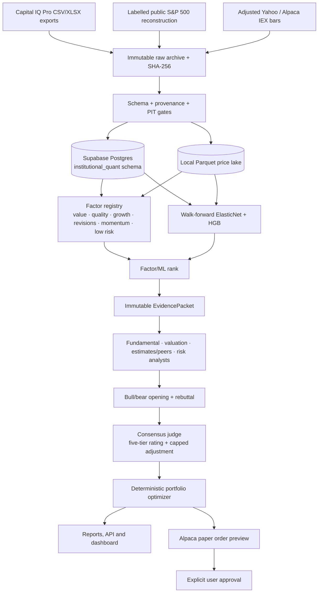
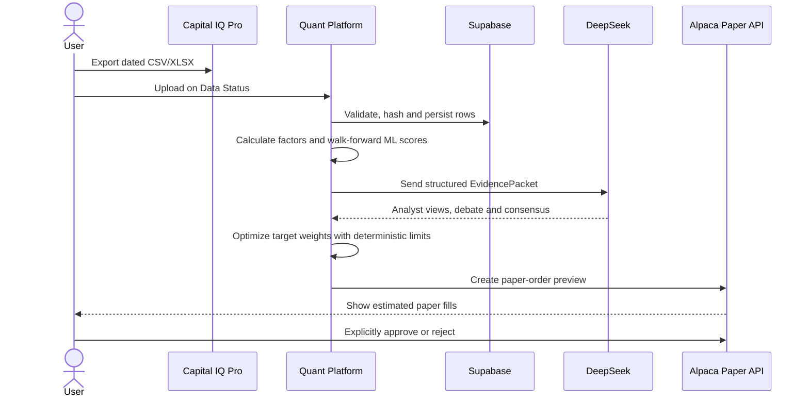

# S&P 500 Institutional Multi-Agent Quant Platform

Local-first, Supabase-backed research software for turning point-in-time S&P 500
exports into auditable factors, walk-forward portfolios and evidence-grounded
multi-agent research reports. It is an academic/self-use research platform, not
investment advice. Alpaca integration is paper-only.

## What is complete

- Supabase `institutional_quant` schema, immutable source manifests and SHA-256 provenance.
- Capital IQ importers for instruments, fundamentals, estimates, membership and prices.
- Six factor families: value, quality, growth, estimate revisions, momentum and low risk.
- Walk-forward ElasticNet and histogram gradient boosting models predicting next-month excess return vs SPY.
- Deterministic 20–30 name long-only optimizer with volatility, position and turnover controls.
- LangGraph evidence packet, four analyst roles, bull/bear opening + rebuttal, and consensus judge.
- FastAPI, Jinja/HTMX and Plotly UI for Data Status, Factor Lab, Research Runs, Debate, Portfolio, Backtest and Paper Trading.
- DeepSeek structured-output routing and cache metadata; only final validated rationale is retained.
- Alpaca paper preview/approval workflow; no live endpoint is accepted.
- Explicit daily, weekly, monthly and full-cycle operation runners, including
  a dedicated `market_returns` table for Capital IQ 1D/1W/1M snapshots.
- English annotated operator guide with 19 reproducible screenshots in
  [`docs/DEMO_RUNBOOK.md`](docs/DEMO_RUNBOOK.md).
- Regression suite: **710 passed, 1 skipped** (optional Bedrock dependency absent).

The current real-data case study is frozen at `output/manifests/case-study-05f56a33-8e7f-4017-be54-d411467b8edb.json` (the directory is intentionally git-ignored because it can contain licensed-data metadata). It covers 60 monthly observations from September 2021 through August 2026, with 5/10/25 bps cost sensitivity. The 10 bps ensemble produced 11.95% CAGR, 12.07% volatility, Sharpe 1.00 and −10.35% maximum drawdown; SPY produced 12.49% CAGR, 15.19% volatility, Sharpe 0.85 and −23.31% drawdown. ML-only was weaker (6.38% CAGR), so the result is reported as a risk-adjusted trade-off, not as forced alpha.

Important limitation: the supplied Capital IQ sector field (`IQ_SECTOR`, KeyField 329067) is a current classification without a historical As-Of parameter in the verified export screen. Historical rows are therefore labeled `Unknown`; the case study is PIT-certified for availability, membership and prices, but **sector-neutral exposure is not certified** until a dated CIQ sector export is supplied. Membership and adjusted prices are explicitly labeled non-CIQ substitutes (public historical reconstruction, Alpaca IEX/Yahoo).

## Architecture



Python owns ratios, timestamps, factor scores, model windows, risk limits,
portfolio weights and orders. Agents explain and challenge the evidence; they
cannot invent data, override missing-data gates or submit orders.

## Author's design philosophy

1. **Institutional data is valuable only when its lineage survives.** Every row carries stable company identity, ticker-at-date, `effective_at`, `as_of_date`, source-file hash and ingestion time.
2. **The LLM is a research committee, not a calculator.** Deterministic Python calculations are reproducible and testable; the model contributes comparison, dissent and concise evidence-linked rationale.
3. **Debate must be falsifiable.** Bull and bear turns cite the same immutable packet, and the judge's score adjustment is bounded so rhetoric cannot dominate the quantitative rank.
4. **Honest underperformance is a valid result.** SPY, equal-weight, factor-only, ML-only and ensemble ablations are retained with transaction costs and statistical qualification; no test-period tuning is used to manufacture a win.
5. **Small and understandable beats over-engineered.** The platform is designed for learning and personal research, while keeping strict the few controls that matter: no look-ahead, no hidden data substitution, and paper-only execution.

## End-to-end user workflow

Capital IQ Pro is the primary company-research source. It supplies statements,
filing availability, consensus estimates/revisions, valuation inputs, peers,
ownership and (when licensed) research evidence. Market APIs are subordinate:
they supply return labels, momentum/volatility features, execution calendars and
paper-account synchronization. DeepSeek is a reasoning layer, never a source of
financial facts.

The normal operating loop is deliberately simple: the user supplies the
institutional export, the platform performs the quantitative work, and the user
approves (or rejects) any simulated order. The same flow can be used for a
single company review or a 20–50 name S&P 500 watchlist.



1. **Export from Capital IQ Pro.** Export the S&P 500 universe and the
   available fundamentals, estimates/revisions, peer, ownership and adjusted
   price fields as CSV/XLSX. Include stable company IDs and every available
   `effective_at`/`as_of_date` field. Keep the original export unchanged.
2. **Import on Data Status.** Upload the files in the UI (or call
   `sp500iq import-ciq`). The importer hashes each file, validates columns and
   timestamps, normalizes units, records rejected rows as data-quality issues,
   and writes only accepted observations to the Supabase `institutional_quant`
   schema.
3. **Discover factors in Factor Lab.** Inspect coverage, rank IC, IC stability,
   quantile monotonicity and factor correlations. The six families are value,
   quality, growth, estimate revisions, momentum and low risk. Ownership and
   insider activity are supplementary features. A name is investable only when
   the minimum coverage and point-in-time gates pass.
4. **Score next-month excess return.** Run the walk-forward ElasticNet and
   histogram-gradient-boosting models. Feature selection, model settings and
   labels are isolated inside each historical training window; the execution
   price is the next available session open. Use **Backtest** to compare SPY,
   equal-weight, factor-only, ML-only and ensemble portfolios.
5. **Run company research and debate.** The platform selects roughly ten names:
   new quantitative leaders, deteriorating holdings and factor/ML disagreements.
   It builds one immutable `EvidencePacket` per name, then runs independent
   fundamental, valuation, estimates/peer and risk analysts followed by one
   bull/bear opening round and one rebuttal round.
6. **Read the investment report.** The Consensus Judge returns a five-tier
   rating—**Buy, Hold, Sell, Watch, or Avoid**—with dissent, uncertainties,
   evidence references and a capped quantitative score adjustment. The report
   is a research decision aid; it is not personalized investment advice.
7. **Combine with current holdings.** The Portfolio page compares the proposed
   names with current paper holdings, highlights adds/reductions/exits and
   calculates deterministic target weights. Limits include long-only exposure,
   approximately 12% annualized volatility, 5% maximum per stock, SPY sector
   deviation targets and weekly/monthly turnover caps. Agents cannot set final
   weights or bypass these limits.
8. **Preview and approve paper orders.** Review share deltas, notionals and
   constraints in **Paper Trading**. The platform talks only to
   `https://paper-api.alpaca.markets`; it creates a preview first and submits
   only after an explicit user approval. Paper fills are simulated and must not
   be interpreted as live-trading performance.

### Cadence

- **Daily:** synchronize Alpaca paper prices/fills and raise risk alerts; do not
  rerun the full Agent committee.
- **Weekly:** refresh market-risk features and permit only limited adjustments.
- **Monthly:** import fresh Capital IQ exports, rebuild factors and ML signals,
  run the Agent debate and produce new target weights.

The same cadence is available as asynchronous API jobs:

```text
POST /api/v1/operations/daily
POST /api/v1/operations/weekly
POST /api/v1/operations/monthly
POST /api/v1/operations/full-cycle
GET  /api/v1/operations/{job_id}
```

`full-cycle` ends with a paper-order preview and `awaiting_approval`; the
separate Paper Trading page requires the operator to inspect and approve the
unchanged preview before submitting one share. See the complete English
procedure, screenshot set and troubleshooting notes in
[`docs/DEMO_RUNBOOK.md`](docs/DEMO_RUNBOOK.md).

## Environment and quick start

```bash
cp .env.example .env
# Fill secrets locally; never commit .env.
export UV_PROJECT_ENVIRONMENT=/Users/guohuiwen/.cache/sp500-institutional-quant-venv
uv sync --extra dev
uv run sp500iq preflight
uv run sp500iq init-db
uv run sp500iq serve
```

Required production values are `SUPABASE_DB_URL`, `DEEPSEEK_API_KEY`,
`ALPACA_PAPER_KEY` and `ALPACA_PAPER_SECRET`. Set
`CIQ_EXTERNAL_PROCESSING_CONFIRMED=true` only after the NTU/S&P agreement permits
sending structured Capital IQ values to DeepSeek; set
`CIQ_CLOUD_STORAGE_CONFIRMED=true` only after cloud persistence is permitted.
The application never prints secret values. `IQ_DATABASE_BACKEND=supabase` is the
production default; DuckDB is reserved for synthetic tests and demos.

## Commands

```bash
uv run sp500iq import-ciq fundamentals /absolute/path/fundamentals.xlsx
uv run sp500iq import-ciq estimates /absolute/path/estimates.xlsx
uv run sp500iq sync-public-sp500-membership --start 2021-09-01 --end 2026-08-31 --refresh-identities
uv run sp500iq sync-yahoo-prices --start 2017-04-01 --end 2026-08-31
uv run sp500iq sync-alpaca-prices --start 2021-09-01 --end 2026-09-02
uv run sp500iq factor-snapshot --as-of 2026-09-01 --top 25
uv run sp500iq case-study
```

Open `http://127.0.0.1:8000`; OpenAPI is at `/docs`. For a no-key engineering
check use `uv run sp500iq synthetic-demo` and `uv run sp500iq backtest-demo`.

## Reproducibility and safety

- Raw exports and reports are ignored by Git; licensed files never enter tests.
- Case-study manifests record source hashes, code hash, model alias/version, reasoning level, prompt version and evidence hash.
- One retry is allowed for invalid structured output; malformed or uncited investment output fails closed.
- A changed model fingerprint starts a new experiment version; hidden reasoning is not persisted or displayed.
- Daily operations synchronize paper prices/fills and risk alerts; weekly updates can make limited adjustments; monthly runs refresh data, factors, agents and target weights.

## Attribution and licenses

The orchestration foundation is adapted from
[TauricResearch/TradingAgents](https://github.com/TauricResearch/TradingAgents),
pinned at commit `2448d0a12576f9b2ddcd5980a0630833423d1e1b`, under Apache-2.0.
The upstream source and license remain in `tradingagents/` and `LICENSE`.
The dashboard uses patterns from the MIT-licensed
[Tabler](https://github.com/tabler/tabler) UI kit; application code in
`institutional_quant/` is project-specific.

All Capital IQ data remains subject to the applicable S&P Global/NTU agreement.
This software is for research and education and does not provide personalized
investment advice.
