# Full S&P 500 Research and Trading Demonstration

This runbook is the operator's guide for the local-first S&P 500 research
platform. It demonstrates one complete daily, weekly and monthly cycle using
the production Supabase database, a Capital IQ Pro return snapshot, the
existing point-in-time fundamentals/estimates, DeepSeek research, and the
Alpaca paper endpoint.

The application is a research and education tool, not investment advice. A
paper fill is simulated. No live brokerage endpoint is accepted.

## Prerequisites and source labels

1. Copy `.env.example` to `.env` and fill the values locally. Required names
   are `SUPABASE_DB_URL`, `DEEPSEEK_API_KEY`, `ALPACA_PAPER_KEY` and
   `ALPACA_PAPER_SECRET`. Never paste secret values into this document or a
   screenshot.
2. Start the service with `uv run sp500iq serve` and open
   `http://127.0.0.1:8000`.
3. Confirm the S&P/NTU agreement allows structured Capital IQ values to be
   processed by the selected model before setting
   `CIQ_EXTERNAL_PROCESSING_CONFIRMED=true`.

Capital IQ is authoritative for company fundamentals, estimates/revisions,
peers and the current 1D/1W/1M return snapshot. The `market_returns` table is a
separate supplementary feature and is never treated as OHLC or adjusted-close
history. Historical S&P 500 membership and adjusted-price bars in this demo
are explicitly labelled substitutes where the licensed export is unavailable.
Supabase stores validated rows and provenance; Alpaca is used only for paper
account synchronization and paper orders.

## The 19-step demonstration

The numbered figures are intentionally short: each blue banner identifies the
operator action, while the underlying page is the real application or the real
Capital IQ export workflow. The same figures are copied into `模拟数据/` for
offline study notes.

### Export and import (Steps 1–8)

1. **Select the Companies screener** in Capital IQ Pro and open the S&P 500
   constituent criterion.
2. **Apply the S&P 500 criterion** so the result set is the point-in-time
   S&P 500 universe, not an arbitrary watchlist.
3. **Add the columns** `Ticker`, `Price Change (1D)`, `Price Change (1W)` and
   `Price Change (1M)`. The importer maps the first three stable
   `SP_PRICE_CHANGE` columns in that order.
4. **Run Results As Values and export** CSV/XLSX. Keep the original workbook
   immutable; its SHA-256 is recorded by the importer.
5. In **Data Status**, select `Current market returns (1D / 1W / 1M)`.
6. Choose the unchanged Capital IQ file.
7. Enter the export's `as_of_date` and the actual observed/effective timestamp.
8. Click **Validate and import**. A successful result records the source hash,
   accepted rows and any non-fatal data-quality warnings.


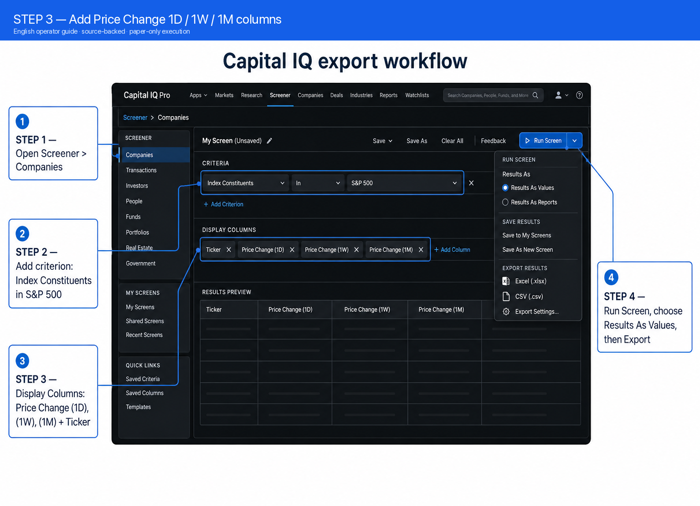
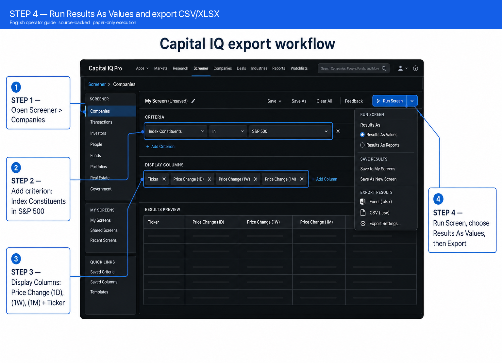


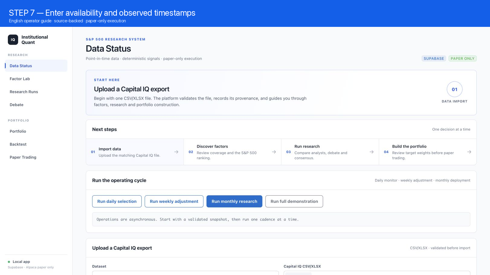


### Daily selection and weekly adjustment (Steps 9–10)

9. **Run daily selection** from the Data Status cadence panel or
   `POST /api/v1/operations/daily`. The service synchronizes paper account
   state, checks risk alerts and ranks candidates using the factor/ML ensemble
   plus a capped sector-neutral short-horizon overlay. It does not run Agents
   and does not rebalance automatically.
10. **Run weekly adjustment** or call
    `POST /api/v1/operations/weekly`. Existing positions can move only within
    the 5% one-way weekly turnover cap. If no monthly portfolio exists, the
    correct result is `held` until deployment.

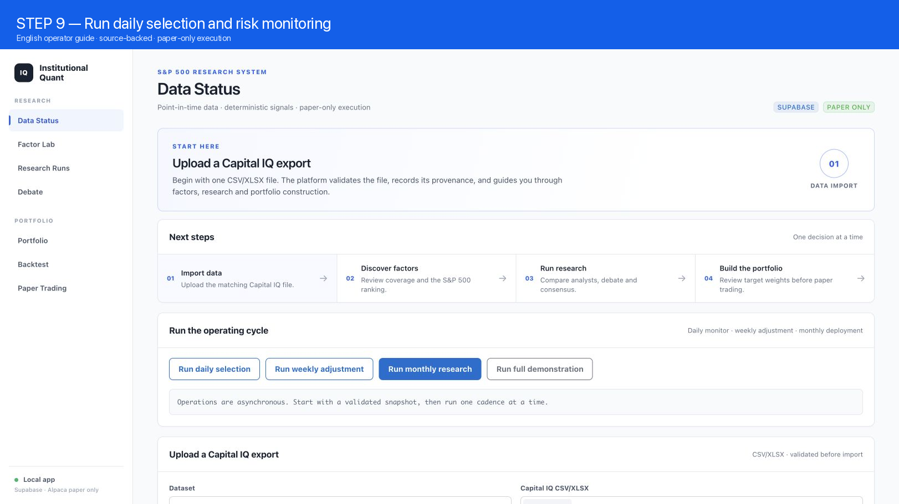
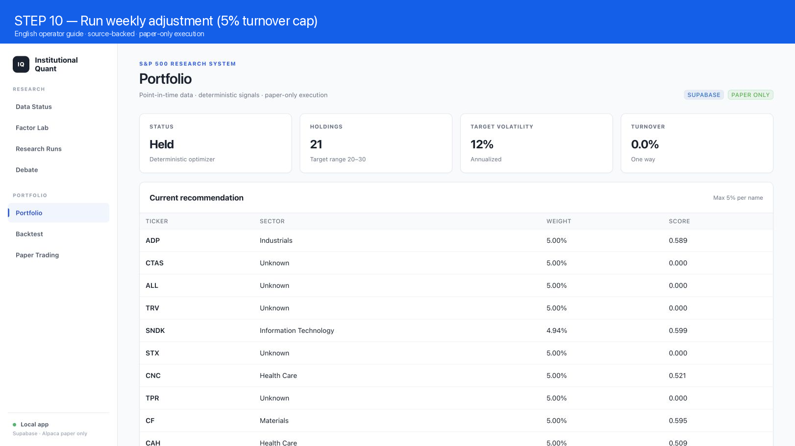

### Monthly research, debate and portfolio (Steps 11–15)

11. Open **Factor Lab** and inspect the latest point-in-time factor snapshot.
    The six families are value, quality, growth, estimate revisions, momentum
    and low risk. Coverage and eligibility are visible before research starts.
12. Start **Run monthly research** or call
    `POST /api/v1/operations/monthly`. Approximately ten names are selected
    from quantitative leaders, deteriorating holdings and factor/ML
    disagreements.
13. Open **Debate** to read the independent fundamental, valuation,
    estimates/peer and risk views, followed by one bull/bear opening round and
    one rebuttal round. All numerical claims link to the immutable evidence
    packet.
14. Read the **Consensus Judge** result: five-tier rating, dissent,
    uncertainties and a bounded score adjustment. The LLM cannot change final
    weights or bypass missing-data gates.
15. Review **Portfolio**. Python calculates the 20–30 long-only target,
    approximately 12% volatility target, 5% name cap, sector limits and
    monthly 20% turnover limit. Current holdings are compared with adds,
    reductions and exits.

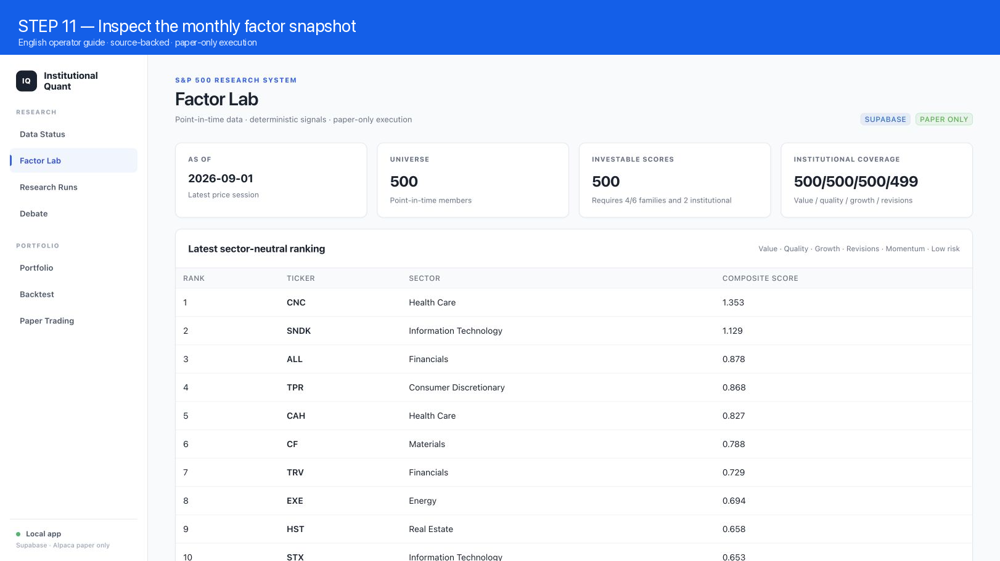
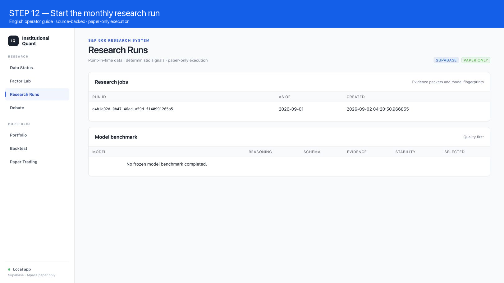
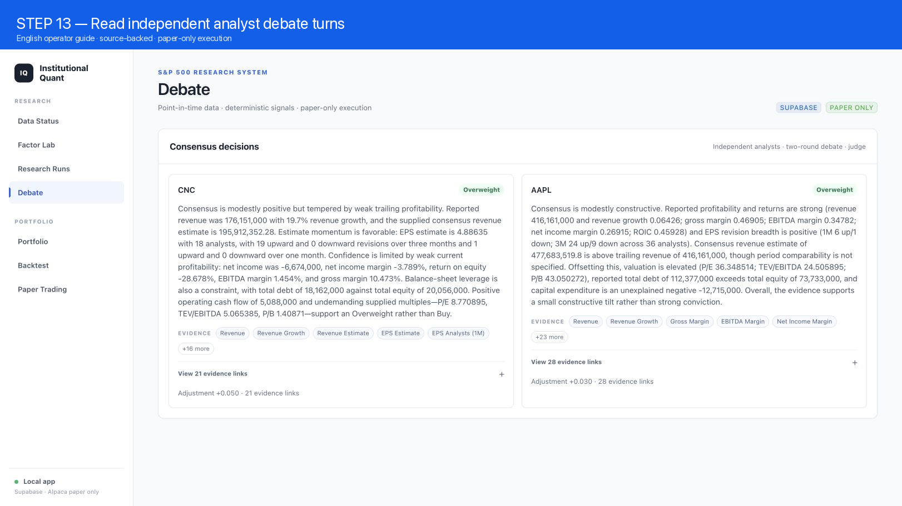

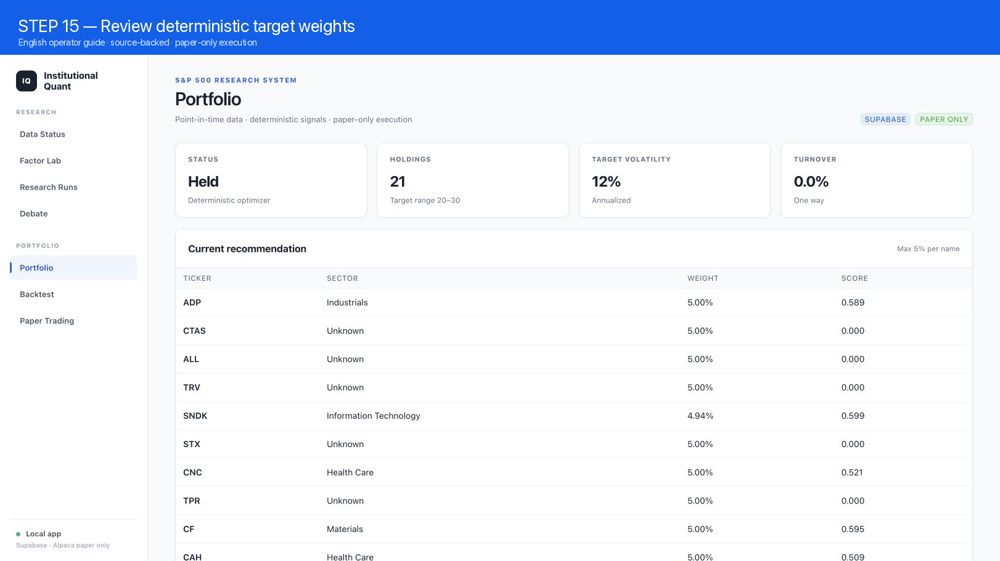

### Paper-only execution (Steps 16–19)

16. In **Paper Trading**, click **Preview one-share order**. The platform
    selects the highest-ranked eligible S&P 500 candidate and shows symbol,
    side, quantity, estimated price/notional, account state, paper endpoint and
    a five-minute expiry.
17. Inspect the unchanged preview and click **Approve & submit unchanged
    preview**. This is the only action that submits an order. A modified,
    unknown or expired preview is rejected.
18. Click **Synchronize paper fills** (or let the next daily monitor call
    `GET /api/v1/paper/sync`) to retrieve simulated positions, order status and
    filled orders.
19. **Run full demonstration** or call
    `POST /api/v1/operations/full-cycle`. The asynchronous job executes data
    readiness → daily → weekly → monthly → paper preview → fill sync. It ends
    at `awaiting_approval`; it never silently submits the paper order.

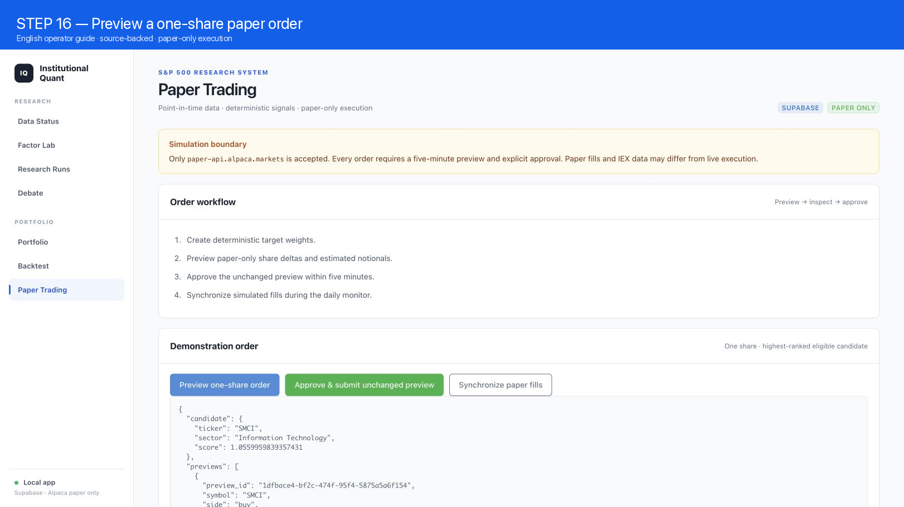
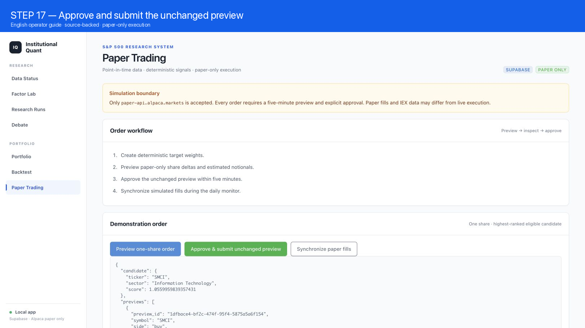
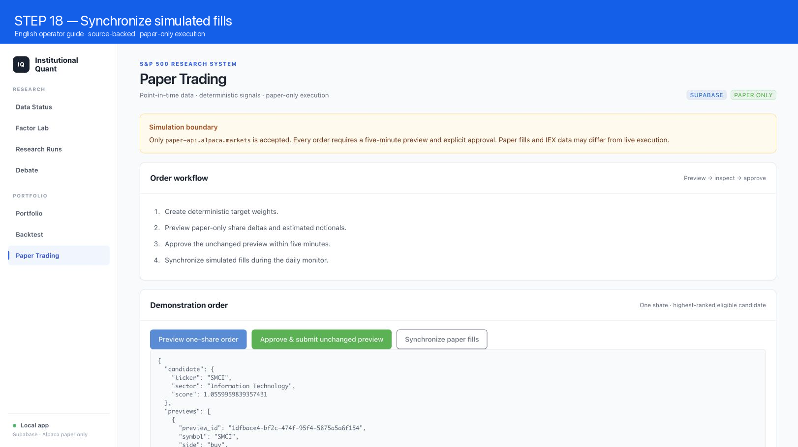
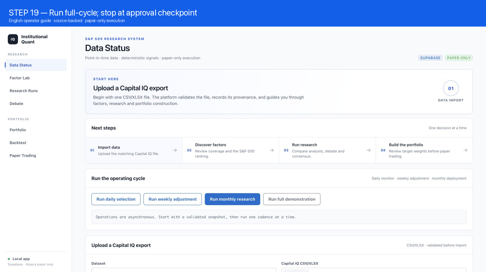

## API and reproducibility

Every cadence endpoint is asynchronous and returns a job ID. Poll
`GET /api/v1/jobs/{id}` or `GET /api/v1/operations/{id}` until the job is
`succeeded` or `failed`. The result includes the cutoff date, selected names,
portfolio recommendation, model/evidence metadata and paper preview. The
order endpoint is deliberately separate:

```text
POST /api/v1/paper/orders/demo-preview
POST /api/v1/paper/orders/submit   {"approved": true, "orders": [...]}
GET  /api/v1/paper/sync
```

The demonstration return workbook is preserved outside Git. Its recorded
source ID is `src_6ff5544376ea528e4fb173d8` and its SHA-256 is
`6ff5544376ea528e4fb173d8b2814c7e36634094a3744a7722161c9ff4226787`.
The snapshot contains 500 accepted S&P 500 observations as of 2026-09-03.
These values are licensed user data; do not redistribute the workbook.

Run the engineering checks with:

```bash
uv run pytest -q
uv run ruff check institutional_quant tests/institutional_quant
curl -fsS http://127.0.0.1:8000/health
```

## Troubleshooting

- **Duplicate price-change headers:** use Results As Values. The importer
  recognizes duplicate `SP_PRICE_CHANGE` columns by stable order and maps them
  to 1D, 1W and 1M. It does not infer adjusted prices from percentages.
- **Timestamp or identity rejection:** supply stable company ID, ticker,
  `as_of_date` and `effective_at`. Missing availability timestamps block PIT
  certification.
- **Warnings for blank rows:** Capital IQ exports can include parameter rows;
  non-observation rows are skipped and retained as warnings.
- **No factor candidates:** inspect Data Status coverage, import fundamentals
  and estimates first, and ensure the historical membership/price substitutes
  cover the requested cutoff.
- **DeepSeek failure:** verify the API key, model alias and external-processing
  agreement. A malformed response fails closed after one retry.
- **Paper order rejected:** use only `https://paper-api.alpaca.markets`, keep
  quantity at one share for this demonstration, and approve before the
  five-minute preview expires.

## Interpretation boundary

The platform helps discover auditable factors and organize research. A higher
score is not a promise of return, and the backtest is not a guarantee of live
performance. Compare SPY, equal-weight, factor-only, ML-only and ensemble
ablations with transaction-cost sensitivity. Report weak or unstable results
as they are; never tune the test period to manufacture outperformance.
