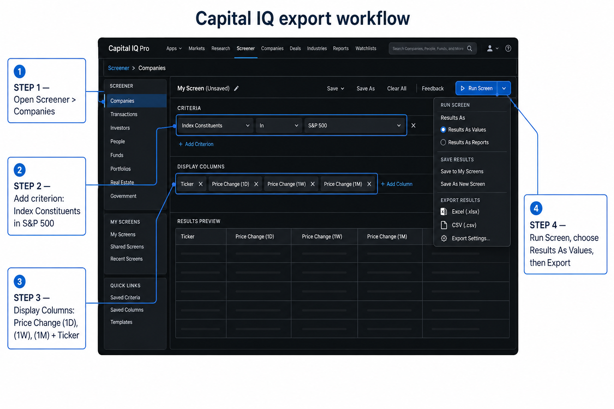
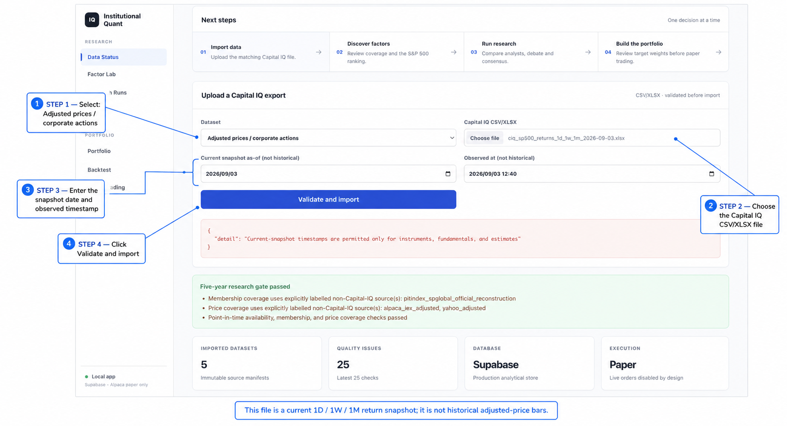

# Capital IQ export walkthrough

## Step 1 — Build the S&P 500 return snapshot in Capital IQ Pro

Open **Screener → Companies**, add the criterion **Index Constituents in S&P 500**, then add these display columns:

- `Ticker`
- `Price Change (1D)`
- `Price Change (1W)`
- `Price Change (1M)`

Run the screen, choose **Results As Values**, and export the result as Excel/CSV.

## Step 2 — Keep the raw export immutable

The exported file is copied without editing into this folder. The current demonstration file is:

`ciq_sp500_returns_1d_1w_1m_2026-09-03.xlsx`

It contains 500 S&P 500 rows and the three Capital IQ price-change snapshots. The source workbook is preserved separately under `data/exports/ciq/`.

## Step 3 — Upload to the platform

In **Data Status**:

1. Select **Adjusted prices / corporate actions** only when the file contains OHLC/adjusted-close history.
2. Choose the exported file.
3. Enter the snapshot date and observed timestamp.
4. Click **Validate and import**.

This demonstration intentionally shows the validation gate: a 1D/1W/1M percentage snapshot is not historical adjusted-price bars, so the current price importer rejects it instead of silently treating percentages as prices. Use a Capital IQ historical price export with `price_date`, OHLC, `adjusted_close`, and availability timestamps for the **prices** dataset. The snapshot remains useful as a supplementary momentum/recent-performance input and should be wired to a dedicated return-snapshot feature in a later step.

## Provenance

- Source: S&P Capital IQ Pro, Companies screener, S&P 500 constituent criterion.
- Export timestamp recorded by the operator: 2026-09-03 12:40 (local display time).
- Raw workbook SHA-256: `6ff5544376ea528e4fb173d8b2814c7e36634094a3744a7722161c9ff4226787`.
